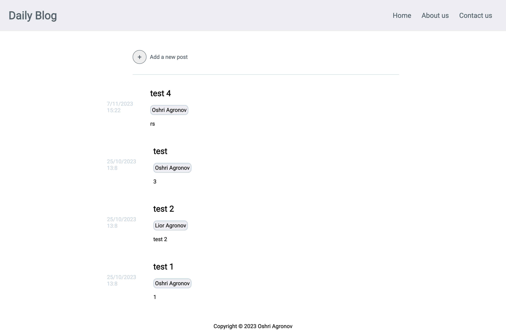
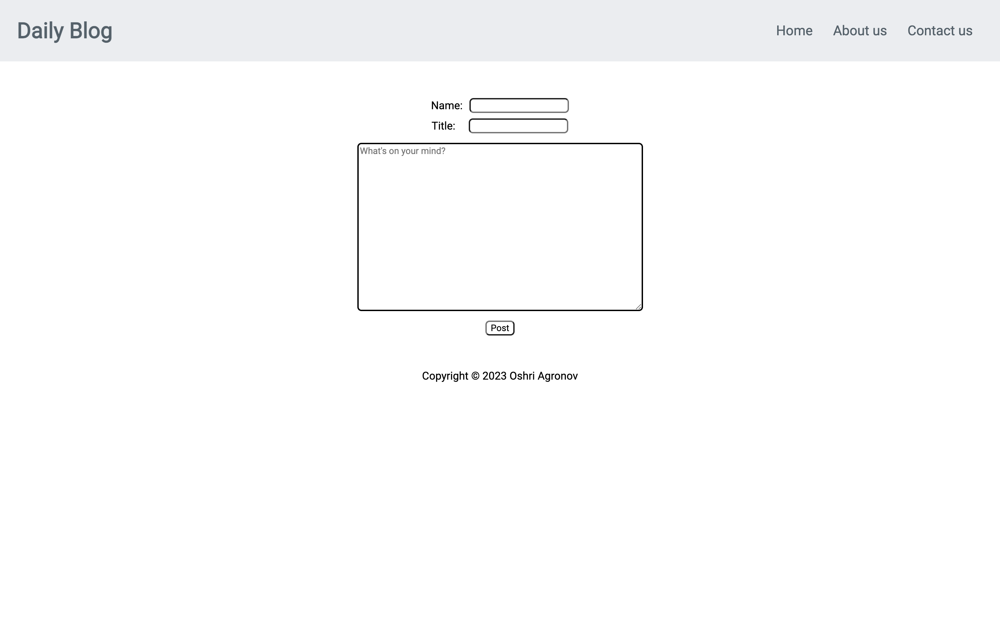
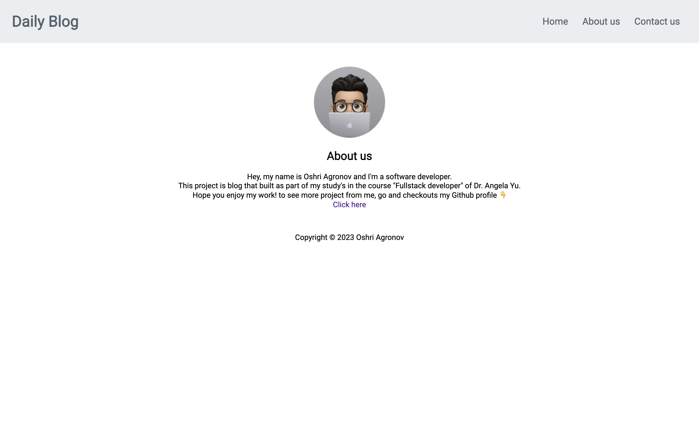
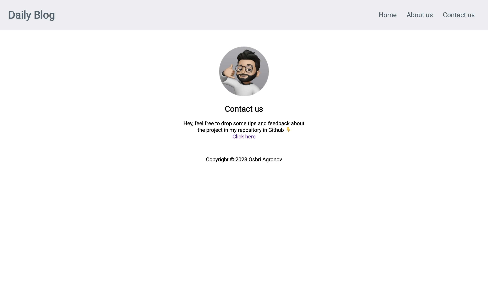

# Blog Website


<br>
The project is a simple blog site where you can write anything on your mind!

## Table of contents
* [General info](#general-info)
* [Technologies](#technologies)
* [Features](#features)
* [Screenshots](#screenshots)
* [Setup](#setup)
* [Acknowledgements](#acknowledgements)

## General info
As you go into the website you will redirect to the home page, Where all the post will showed up in timeline order(from latest to oldest).
Above the posts timeline, the user will have a "+" button for creating a post and click on the button will redirect to the compose page where
the user can write the post and publish it to the site.


## Technologies
- Software language: JS, HTML, CSS.
- Frameworks: Node.js .
- NPM modules dependencies: express, mongoose, bodyParser.
- Database: MongoDB (NoSQL).

## Features
- User can create posts.
- All the data is saved locally using MongoDB as database, so refresh the page won't erase the data.

## Screenshots








## Setup
To run the Blog website you need couple of softwares:
- node.js .
- npm modules I included(easy to install).
- MongoDB.
> You can install all the above pretty easily with a quick search on youtube for a guide.

### How to start?
1. First download the folder with the files from the repo.
2. Open terminal in the project folder and install all the modules by the entering the commend:

```bash
npm i
```

3. Run the project with node(or nodemon):

```bash
node app.js
```
4. Open the browser and enter in the url bar:
```
localhost:3000
```
5. And you are done! enjoy you personal post site.

## Acknowledgements
I would like to thank to Dr. Angela Yu for creating the great course "The Complete 2023 Web Development Bootcamp".
> Link to the course [here](https://www.udemy.com/course/the-complete-web-development-bootcamp/?kw=The+Complete+2023+Web+Development+Bootcamp&src=sac)
